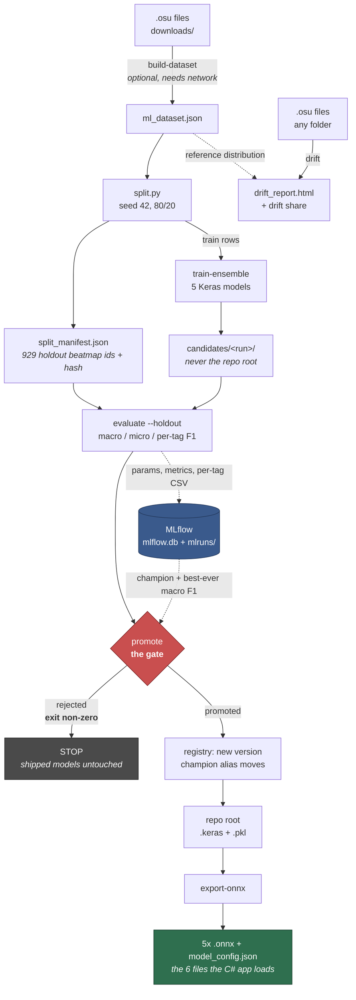

# osu! Beatmap Classifier

## Overview

`osu-beatmap-classifier` is a machine learning project designed to analyze `.osu` beatmap files and predict descriptive tags such as "streams," "jumps," and "finger control." It uses a neural network trained on data scraped from [echosu.com](https://echosu.com/) to learn the relationship between hit object patterns and common mapping terminology.

This tool can be used to automatically tag a library of beatmaps, assist mappers in understanding their creations, or serve as a foundation for more advanced beatmap analysis tools.

## Features

-   **Data Collection**: Builds a dataset by downloading beatmap info and tags from the Echo API.
-   **Advanced Feature Extraction**: Analyzes hit object data to extract 90 meaningful geometric features, including stream purity, finger control metrics, and global snap variance.
-   **Deep Learning Architecture**: Uses a TensorFlow/Keras Dense Neural Network to classify beatmaps into multiple overlapping tag categories.
-   **5-Model Ensemble Learning**: Features a robust voting classifier that trains 5 distinct neural networks simultaneously, reducing variance and correcting single-model bias on subjective tags.
-   **Deterministic Feature Injection**: Hard-coded mechanical rules (e.g., forcing the "streams" tag if a 15+ note sequence is detected) to prevent the black-box AI from missing absolute geometric truths.
-   **Interactive CLI**: A command-line interface to easily train models, evaluate ensembles, and predict tags for local `.osu` files.

## How It Works

The project follows a standard, modular machine learning pipeline:
1.  **Dataset Construction** (`dataset_builder.py`, `rebuild_from_downloaded.py`): Beatmap IDs and tags are fetched from the Echo API. The corresponding `.osu` files are downloaded.
2.  **Parsing & Feature Extraction** (`osu_parser.py`, `neural_model.py`): The `.osu` files are parsed to extract raw coordinates. This is transformed into a high-dimensional feature vector representing micro-patterns and spatial flow.
3.  **Model Training** (`neural_model.py`): The feature vectors train a multi-label classification neural network. The trained baseline model is saved to `beatmap_classifier.pkl`.
4.  **Ensemble Evaluation** (`ensemble_evaluator.py`): Trains 5 independent models (`ensemble_model_1.keras` to `5`) and aggregates their probabilities to drastically improve F1-Scores on minority tags.
5.  **Prediction** (`main.py`, `predict_for_overlay.py`): Predicts tags for any new `.osu` file, automatically prioritizing the 5-model ensemble if it detects one on disk.

## Setup and Installation

**Prerequisites:**
-   Python 3.8+
-   Git

**1. Clone the repository:**
```bash
git clone https://github.com/AliKhairy/osu-beatmap-classifier.git
cd osu-beatmap-classifier
```

**2. Set up a virtual environment (recommended):**
```bash
python -m venv venv
source venv/bin/activate  # On Windows, use `venv\Scripts\activate`
```

**3. Install dependencies:**
```bash
pip install -r requirements.txt
```

**4. Configure your API Token:**
You need an API token from `echosu.com`.
-   Create a file named `.env` in the root of the project directory.
-   Add your token to this file like so:
    ```
    ECHO_API_TOKEN="YourEchosuApiTokenHere"
    OSU_CLIENT_ID = 'YourID'
    OSU_CLIENT_SECRET = 'YourOsuApiTokenHere'
    ```

**5. Prepare Beatmap Folders:**
The application uses two folders for `.osu` files:
-   `downloads/`: Used by `rebuild_from_downloaded.py` to process local maps.
-   `songs/`: Used by the interactive prediction menu in `main.py` to find maps for testing.

Create these folders if they don't exist and place some `.osu` files inside them.

## Usage

The main entry point is `main.py`. You can run it from the command line:

```bash
python main.py
```

This will launch an interactive menu that guides you through the following options:
-   **Build Dataset & Train:** If no model exists, it will automatically start the process.
-   **Predict Tags**: Analyze a single `.osu` file from your `songs` folder.
-   **Test Model**: Run predictions on multiple maps to see the model's performance.
-   **Retrain/Rebuild**: Update the model or rebuild the entire dataset from scratch.

## Exporting Models for the App (ONNX)

The desktop app (**OsuScoutNew**) does not run Python or Keras. It runs inference
on-device using ONNX Runtime. Training produces Keras/scikit-learn artifacts; two
scripts convert those into the exact files the app consumes:

| Training artifact                     | Export script         | App file (`OsuScoutNew/Assets/`) |
| ------------------------------------- | --------------------- | -------------------------------- |
| `ensemble_model_1..5.keras`           | `export_to_onnx.py`   | `ensemble_model_1..5.onnx`       |
| `ensemble_scaler.pkl` + `..._binarizer.pkl` | `extract_config.py` | `model_config.json`              |

**To regenerate the model files after (re)training:**
```bash
python cli.py export-onnx
```
This produces all 6 files: `ensemble_model_1.onnx` ... `ensemble_model_5.onnx`
and `model_config.json`, and exits non-zero if any of them is missing.

Both steps are deliberately one command. `model_config.json` carries the scaler
constants and tag list, so it **must** come from the same training run as the
`.onnx` files — a config from a different run standardises the features with the
wrong numbers and corrupts every prediction without raising an error. When these
were two scripts you had to remember to run, forgetting the second one was a
silent failure. The individual scripts still work standalone
(`python export_to_onnx.py`, `python extract_config.py`) and both now accept a
model directory, so a candidate can be exported without being promoted first.

## Shipping a Model Update to the App

The app auto-updates via Velopack/GitHub Releases, and the model files are bundled
into the app (marked `CopyToOutputDirectory` in `OsuScoutNew.csproj`). So shipping a
new model is the same as shipping any app update:

1. **Retrain** a candidate: `python cli.py train-ensemble --out-dir candidates/my-run`.
   (`python main.py` -> retrain still works and still writes to the repo root.)
2. **Gate it**: `python cli.py promote --candidate candidates/my-run`. A non-zero
   exit means it did not beat the current champion and must not be shipped —
   see [Tracked and Gated Model Quality](#tracked-and-gated-model-quality).
3. **Export** the 6 files: `python cli.py export-onnx`.
4. **Copy** all 6 into `OsuScoutNew/Assets/`, replacing the old ones.
5. In the app repo: bump the version, `dotnet publish`, `vpk pack`, and upload the
   release. Users auto-update and receive the new model on next launch.

Steps 1–3 are also available as a single Prefect flow (`python cli.py pipeline`),
in which a rejected candidate never reaches the export step.

> **Feature count must stay in sync.** The C# `FeatureExtractor` computes the input
> vector (currently 90 features) and `OsuClassifier` validates that exact length. If
> you change the **number or order of features** in `neural_model.py`, you must make
> the **identical** change in the app's `FeatureExtractor.cs` and retrain. Adding new
> **tags** (without changing feature count) needs no C# change — the tag list is read
> from `model_config.json` at runtime.

## Tracked and Gated Model Quality

Retraining used to be unaccountable. `train-ensemble` printed a
`classification_report` and threw it away, so there was no record of what any
model scored, no way to compare two of them, and nothing stopping a worse model
from being exported and shipped. The pipeline below fixes that: every run is
recorded, and a model only reaches the app if it survives a gate.

### The pipeline



### What the gate does

`promote` refuses to let a regression through. It scores the candidate **and**
the current champion on the same frozen holdout — re-scoring the champion rather
than trusting its stored number, so a dataset that has moved cannot make the
comparison lie — and then applies two conditions:

```
promote  iff  candidate >= champion  - tolerance
         and  candidate >= best_ever - tolerance
```

Both must hold. With no champion registered, the first model promotes
unconditionally.

The second condition is the one that is easy to leave out. A gate that only
compares against the incumbent has a slow failure mode: each promotion resets
the baseline, so a run of candidates each a hair worse than the last passes
every individual check while quality slides. Ten promotions each 0.004 below
their predecessor lose 0.04 macro F1 with the gate green the entire way. The
best-ever floor is what stops that.

**The tolerance is measured, not chosen.** Training the identical configuration
twice gives different macro F1 — weight init and batch shuffling differ — so a
tolerance below that noise floor rejects honest reruns, and one far above it
waves real regressions through. See VERIFIED.md for the three-seed calibration
and the resulting number.

Macro F1 is the gate metric because it weights all 66 tags equally regardless of
support: a model that quietly abandons rare tags to improve on common ones
should not pass. The per-tag CSV logged alongside it is what tells you *why* a
number moved.

Two things the gate score is **not**:

- It scores raw thresholded output, without the expert-system override that
  forces the `streams` tag on 15+ note sequences at predict time. It measures
  the network, not the network plus a hand-written rule.
- The scaler is fit on all rows before splitting (pre-existing, preserved for
  C# parity), so absolute numbers are mildly optimistic. It applies identically
  to every model compared, so the comparison stays fair.

### Running it

Everything below is a `cli.py` subcommand and follows the same contract as the
rest: **0 on success, non-zero on failure.**

```bash
# Record the fixed evaluation split (writes split_manifest.json)
python split.py

# Train a candidate WITHOUT touching the models in the repo root
python cli.py train-ensemble --out-dir candidates/my-run --train-seed 1

# Score it on the frozen holdout and log the run to MLflow
python cli.py evaluate --holdout --model-dir candidates/my-run

# Gate it. Exit 0 = promoted, non-zero = rejected.
python cli.py promote --candidate candidates/my-run

# Export the 6 files the app loads (5x .onnx + model_config.json)
python cli.py export-onnx

# Or run train -> evaluate -> gate -> export as one Prefect flow.
# A rejected candidate never reaches the export step.
python cli.py pipeline --train-seed 1

# Check whether a folder of maps looks like the training data
python cli.py drift --maps songs/
```

Use `--root-dir <dir>` on `promote` and `pipeline` to exercise promotion
without replacing the models in the repo root.

### Seeing the runs

```bash
mlflow ui --backend-store-uri sqlite:///mlflow.db
```

Backend is a local SQLite file plus `mlruns/`, both gitignored and
dockerignored. SQLite rather than the default file store because the model
registry's alias support — how the `champion` is tracked — needs a
database-backed store.

### Trying it without the real dataset

`ml_dataset.json` is ~528 MB and is not in the repo. `samples/sample_features.csv`
holds 60 already-extracted feature vectors with their tags, covering all 66
labels, so the pipeline runs end to end on a checkout:

```bash
python cli.py train-ensemble --dataset samples/sample_features.csv \
    --out-dir candidates/sample --epochs 5
```

It contains **derived statistics and tag labels only — no beatmap content**, and
is drawn entirely from training rows, so it never overlaps the evaluation
holdout. Sixty maps across 66 labels trains a model that is statistically
meaningless; the point is that the machinery runs, not that the result is good.

## License

This project is licensed under the MIT License. See the `LICENSE` file for details.
