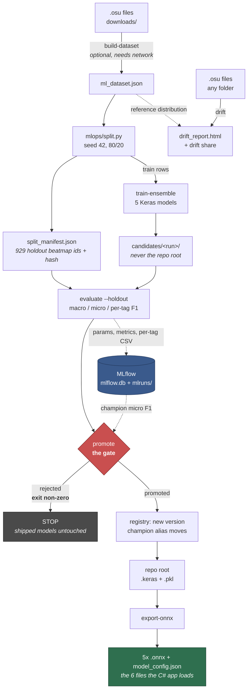

# osu! Beatmap Classifier

## Overview

`osu-beatmap-classifier` is a machine learning project designed to analyze `.osu` beatmap files and predict descriptive tags such as "streams," "jumps," and "finger control." It uses a neural network trained on data scraped from [echosu.com](https://echosu.com/) to learn the relationship between hit object patterns and common mapping terminology.

This tool can be used to automatically tag a library of beatmaps, assist mappers in understanding their creations, or serve as a foundation for more advanced beatmap analysis tools.

## Features

-   **Data Collection**: Builds a dataset by downloading beatmap info and tags from the Echo API.
-   **Feature Extraction**: Turns hit objects, difficulty settings and timing points into a feature vector: v1 (90 features, what the shipped app has computed so far) or v2 (72 features built against each tag's definition; see [v2 features](#v2-features)).
-   **Deep Learning Architecture**: Uses a TensorFlow/Keras Dense Neural Network to classify beatmaps into multiple overlapping tag categories.
-   **5-Model Ensemble Learning**: Features a robust voting classifier that trains 5 distinct neural networks simultaneously, reducing variance and correcting single-model bias on subjective tags.
-   **Deterministic Feature Injection**: Hard-coded mechanical rules (e.g., forcing the "streams" tag if a 15+ note sequence is detected) to prevent the black-box AI from missing absolute geometric truths.
-   **Interactive CLI**: A command-line interface to easily train models, evaluate ensembles, and predict tags for local `.osu` files.

## How It Works

The library is the `osu_tagger` package; the pipeline runs through it in order:
1.  **Dataset Construction** (`osu_tagger/data/`): beatmap IDs and tags come from the Echo API, `.osu` files from the osu! API, and `map_meta.json` adds each map's difficulty and timing points.
2.  **Parsing & Feature Extraction** (`osu_tagger/parsing.py`, `osu_tagger/features/`): `.osu` files are parsed into hit objects, difficulty and timing points, then turned into the v1 or v2 feature vector.
3.  **Model Training** (`osu_tagger/training/ensemble.py`): trains 5 independent models (`ensemble_model_1.keras` to `5`) and averages their probabilities. A legacy single model (`beatmap_classifier.pkl`) can still be trained with `cli.py train`.
4.  **Gating** (`mlops/`): a candidate is scored on a frozen holdout and only replaces the current model if it holds up.
5.  **Export** (`osu_tagger/export/`): the ensemble becomes the 5 `.onnx` files and `model_config.json` the desktop app loads.

## Setup and Installation

**Prerequisites:**
-   Python 3.8+
-   Git

**1. Clone the repository:**
```bash
git clone https://github.com/AliKhairy/osu-beatmap-classifier.git
cd osu-beatmap-classifier
```

**2. Set up a virtual environment (recommended):**
```bash
python -m venv venv
source venv/bin/activate  # On Windows, use `venv\Scripts\activate`
```

**3. Install dependencies:**
```bash
pip install -r requirements.txt
```

**4. Configure your API Token:**
You need an API token from `echosu.com`.
-   Create a file named `.env` in the root of the project directory.
-   Add your token to this file like so:
    ```
    ECHO_API_TOKEN="YourEchosuApiTokenHere"
    OSU_CLIENT_ID = 'YourID'
    OSU_CLIENT_SECRET = 'YourOsuApiTokenHere'
    ```

**5. Prepare Beatmap Folders:**
The application uses two folders for `.osu` files:
-   `downloads/`: Used by `cli.py rebuild` and `cli.py enrich-dataset` to process local maps.
-   `songs/`: Used by the interactive prediction menu in `main.py` to find maps for testing.

Create these folders if they don't exist and place some `.osu` files inside them.

## Usage

The main entry point is `main.py`. You can run it from the command line:

```bash
python main.py
```

This will launch an interactive menu that guides you through the following options:
-   **Build Dataset & Train:** If no model exists, it will automatically start the process.
-   **Predict Tags**: Analyze a single `.osu` file from your `songs` folder.
-   **Test Model**: Run predictions on multiple maps to see the model's performance.
-   **Retrain/Rebuild**: Update the model or rebuild the entire dataset from scratch.

## Exporting Models for the App (ONNX)

The desktop app (**OsuScoutNew**) does not run Python or Keras. It runs inference
on-device using ONNX Runtime. Training produces Keras/scikit-learn artifacts; two
scripts convert those into the exact files the app consumes:

| Training artifact                     | Export module                | App file (`OsuScoutNew/Assets/`) |
| ------------------------------------- | ---------------------------- | -------------------------------- |
| `ensemble_model_1..5.keras`           | `osu_tagger/export/onnx.py`  | `ensemble_model_1..5.onnx`       |
| `ensemble_scaler.pkl` + `..._binarizer.pkl` | `osu_tagger/export/config.py` | `model_config.json`        |

**To regenerate the model files after (re)training:**
```bash
python cli.py export-onnx
```
This produces all 6 files: `ensemble_model_1.onnx` ... `ensemble_model_5.onnx`
and `model_config.json`, and exits non-zero if any of them is missing.

Both steps are deliberately one command. `model_config.json` carries the scaler
constants and tag list, so it **must** come from the same training run as the
`.onnx` files — a config from a different run standardises the features with the
wrong numbers and corrupts every prediction without raising an error. When these
were two scripts you had to remember to run, forgetting the second one was a
silent failure. The two halves still run standalone
(`python -m osu_tagger.export.onnx`, `python -m osu_tagger.export.config`) and both
accept a model directory, so a candidate can be exported without being promoted first.

## Shipping a Model Update to the App

The app auto-updates via Velopack/GitHub Releases, and the model files are bundled
into the app (marked `CopyToOutputDirectory` in `OsuScoutNew.csproj`). So shipping a
new model is the same as shipping any app update:

1. **Retrain** a candidate: `python cli.py train-ensemble --out-dir candidates/my-run`.
   (`python main.py` -> retrain still works and still writes to the repo root.)
2. **Gate it**: `python cli.py promote --candidate candidates/my-run`. A non-zero
   exit means it did not beat the current champion and must not be shipped —
   see [Tracked and Gated Model Quality](#tracked-and-gated-model-quality).
3. **Export** the 6 files: `python cli.py export-onnx`.
4. **Copy** all 6 into `OsuScoutNew/Assets/`, replacing the old ones.
5. In the app repo: bump the version, `dotnet publish`, `vpk pack`, and upload the
   release. Users auto-update and receive the new model on next launch.

Steps 1–3 are also available as a single Prefect flow (`python cli.py pipeline`),
in which a rejected candidate never reaches the export step.

> **Features must stay in sync.** The app computes the input vector itself:
> `FeatureExtractor.cs` mirrors `osu_tagger/features/v1.py` and `FeatureExtractorV2.cs`
> mirrors `osu_tagger/features/v2.py`; `model_config.json`'s `feature_version` says
> which one runs. If you change the **math, number or order of features**, make the
> **identical** change in the app, regenerate the goldens and run the parity harness
> (`OsuScoutNew/parity`). Adding or changing **tags**, the threshold or the redundancy
> rules needs no C# change: they are all read from `model_config.json` at runtime.

## Tracked and Gated Model Quality

Retraining used to be unaccountable. `train-ensemble` printed a
`classification_report` and threw it away, so there was no record of what any
model scored, no way to compare two of them, and nothing stopping a worse model
from being exported and shipped. The pipeline below fixes that: every run is
recorded, and a model only reaches the app if it survives a gate.

### The pipeline


```mermaid
flowchart TD
    A[".osu files<br/>downloads/"] -->|build-dataset<br/><i>optional, needs network</i>| B["ml_dataset.json"]
    B --> C["mlops/split.py<br/>seed 42, 80/20"]
    C --> D["split_manifest.json<br/><i>929 holdout beatmap ids + hash</i>"]
    C -->|train rows| E["train-ensemble<br/>5 Keras models"]
    E --> F["candidates/&lt;run&gt;/<br/><i>never the repo root</i>"]
    F --> G["evaluate --holdout<br/>macro / micro / per-tag F1"]
    D --> G
    G --> H{"promote<br/><b>the gate</b>"}
    I[("MLflow<br/>mlflow.db + mlruns/")] -.->|champion micro F1| H
    G -.->|params, metrics, per-tag CSV| I
    H -->|"rejected<br/><b>exit non-zero</b>"| X["STOP<br/><i>shipped models untouched</i>"]
    H -->|promoted| J["registry: new version<br/>champion alias moves"]
    J --> K["repo root<br/>.keras + .pkl"]
    K --> L["export-onnx"]
    L --> M["5x .onnx + model_config.json<br/><i>the 6 files the C# app loads</i>"]
    N[".osu files<br/>any folder"] -->|drift| O["drift_report.html<br/>+ drift share"]
    B -.->|reference distribution| O

    style H fill:#c94f4f,stroke:#7a2020,color:#fff
    style X fill:#4a4a4a,stroke:#222,color:#fff
    style M fill:#2f6f4f,stroke:#1b4030,color:#fff
    style I fill:#3a5a8c,stroke:#22375a,color:#fff
```

### Where the code lives

```
cli.py           the command-line entry point (and the Docker ENTRYPOINT)
main.py          the interactive menu
neural_model.py  shim so the legacy beatmap_classifier.pkl still loads
osu_tagger/      parsing.py         .osu files: hit objects, difficulty, timing points
                 features/v1.py     the 90-feature vector the shipped app computes
                 features/v2.py     the 72-feature v2 vector
                 data/              echosu.py, osu_api.py, tags.py (tag sources),
                                    builder.py, rebuild.py (the dataset),
                                    map_meta.py (the difficulty/timing sidecar)
                 training/ensemble.py  the 5-model ensemble
                 export/            onnx.py, config.py: the app's 6 model files
                 parity/            dump.py, goldens.py: references for the C# port
mlops/           split.py        the frozen evaluation split, and data prep
                 labels.py       the label policy (which tags are trained)
                 scoring.py      loading an ensemble and scoring it
                 metrics_report.py  micro/macro/per-tag F1
                 tracking.py     MLflow wiring
                 registry.py     the ensemble as one registered pyfunc model
                 promote.py      the gate decision (pure, unit-tested)
                 drift.py        Evidently batch drift
flows/           pipeline.py     the Prefect flow
tools/           calibrate_gate.py  measuring the gate's noise and tolerance
                 feature_probe.py   comparing feature sets on a dev split
                 tag_quality.py     per-tag precision/recall/AUC side by side
                 map_probabilities.py  every tag's probability per map (cli: tag-probabilities)
                 compare_on_maps.py    two models' tags side by side on a folder
tests/           test_features.py     v1 extractor + golden-vector regression
                 test_features_v2.py  v2 extractor, one test per v1 flaw
                 test_labels.py       label policy + scoring across label spaces
                 test_gate.py         the gate
samples/         sample_features.csv
docs/            feature_v2_spec.md  the C# port spec for v2
```

Only three files sit at the root, each for a reason. `cli.py` is the Dockerfile
entrypoint, and `main.py` is the interactive menu. `neural_model.py` is a two-line
shim: `beatmap_classifier.pkl` pickles an `ImprovedBeatmapClassifier` *instance*,
and pickle records the module path, so without a module of that name the file
fails to load at runtime. The code itself lives in `osu_tagger/features/v1.py`.

### What the gate does

`promote` refuses to let a regression through. It scores the candidate **and**
the current champion on the same frozen holdout — re-scoring the champion rather
than trusting its stored number, so a dataset that has moved cannot make the
comparison lie — and then applies three conditions:

```
promote  iff  micro_f1 >= champion  - tolerance      (skipped if no champion)
         and  micro_f1 >= reference - tolerance      (fixed anchor)
         and  never-predicted tags (support >= 10) <= champion's + 1
```

All must hold. Note the fixed reference applies even on the very first
promotion: an empty registry is not a licence to ship anything.

**Micro F1, not macro.** Macro F1 weights every tag equally, which sounds like
the right way to stop a model abandoning rare tags — but on this holdout tag
support ranges from 2 to 345, and macro F1 varies by 0.0237 (6.8% of the metric)
across runs of the *identical* configuration. A tolerance honestly calibrated to
that noise would permit a ~7% real regression, which is a formality rather than
a gate. Micro F1 varies by ~1%, so a tolerance calibrated to it still bites.

Rule 3 is what replaces macro's rare-tag protection, and it targets the hole
directly: the candidate may not go mute on more tags than the champion does.
It is restricted to tags with support ≥ 10 because the count over every tag
swings 11–16 between identical reruns, while the restricted count is a stable 1–2.

**The tolerance is measured, not chosen** — `k × σ` where σ is the seed-to-seed
standard deviation of micro F1 and `k = 5`. σ rather than the observed max gap,
because the max gap is an order statistic that keeps widening as runs are added;
σ converges. k is set so an ordinary `mean − 2σ` candidate still passes: the
champion is itself a noisy draw, sitting 2.77σ above the retrained seeds' mean on
the current labels, so the tolerance must cover 2.77σ + 2σ ≈ 4.8σ. (It was
k = 4 on the original 66 labels, where the champion sat 1.89σ above.) See
VERIFIED.md §11, §12 and §14 for the 10-seed calibrations, the validation showing every
honest rerun passes and the 1-epoch model fails, and the first-attempt gate that
got this wrong.

**The ratchet floor is a fixed reference, not best-ever.** Anchoring to the best
score ever recorded looks stricter but is a trap: best-ever is the maximum of
many noisy runs, so it is biased upward and only ever rises — the gate tightens
on its own until it rejects ordinary reruns. Measured, an early macro-F1
tolerance rejected 3 of 10 honest reruns against the real champion but 7 of 10
once a best-ever floor was added. The reference is the v1 champion's score, so
the rule reads: never ship a model meaningfully worse than what users already
have. It is measured on the current label space (below), so it moves exactly
when the question the model answers moves.

### Labels: skills only

echosu tags are free-form community votes, so the raw vocabulary mixes playing
skills with tags about what a map is for, how it feels, or which mod to play it
with, and some skills go by two names. `mlops/labels.py` holds the policy, and
both the scraper and dataset preparation apply it:

- **Dropped** (not skills): progressive difficulty, practise, comfortable,
  dt speed, fast.
- **Merged** (one skill, two names): alt → alternating, snap → snap aim,
  flow → flow aim.

That leaves 58 labels. The policy runs after the feature cache and keeps every
row, including the 2 maps left with no labels, so the frozen holdout does not
move. A model trained under an older policy is still scored on the current
labels: dropped columns are discarded and merged tags take the max of their
members. Any label difference the policy does not explain is refused.

### From probabilities to tags

Also in `mlops/labels.py`, and exported into `model_config.json` so the app reads
it instead of compiling it in:

- **Threshold 0.26**, applied at display precision: a tag counts when its
  probability *shown to two decimals* reaches the threshold, so a tag shown as
  0.26 is always predicted at 0.26 (the raw cutoff is 0.255). Chosen from the
  dev-split sweep, where micro F1 is flat from about 0.26 to 0.34 and falls
  either side.
- **Redundant tags are hidden.** `jumps` is dropped when `large jumps`,
  `short jumps` or `cross screen jumps` is shown, and `high spacing` when
  `large jumps` or `cross screen jumps` is. The app searches tags by substring,
  so a `jumps` search still finds those maps. This is presentation only: the
  gate still scores the network's raw predictions.

The per-tag CSV logged alongside each run is what tells you *why* a number moved.

Two things the gate score is **not**:

- It scores raw thresholded output, without the expert-system override that
  forces the `streams` tag on 15+ note sequences at predict time. It measures
  the network, not the network plus a hand-written rule.
- The scaler is fit on all rows before splitting (pre-existing, preserved for
  C# parity), so absolute numbers are mildly optimistic. It applies identically
  to every model compared, so the comparison stays fair.

### Running it

Everything below is a `cli.py` subcommand and follows the same contract as the
rest: **0 on success, non-zero on failure.**

```bash
# Record the fixed evaluation split (writes split_manifest.json)
python -m mlops.split

# Train a candidate WITHOUT touching the models in the repo root
python cli.py train-ensemble --out-dir candidates/my-run --train-seed 1

# Score it on the frozen holdout and log the run to MLflow
python cli.py evaluate --holdout --model-dir candidates/my-run

# Gate it. Exit 0 = promoted, non-zero = rejected.
python cli.py promote --candidate candidates/my-run

# Export the 6 files the app loads (5x .onnx + model_config.json)
python cli.py export-onnx

# Or run train -> evaluate -> gate -> export as one Prefect flow.
# A rejected candidate never reaches the export step.
python cli.py pipeline --train-seed 1

# Check whether a folder of maps looks like the training data
python cli.py drift --maps songs/

# Every tag's probability for every map in songs/, from one or more models
# (terminal view + reports/map_probabilities.csv and .json)
python cli.py tag-probabilities --model-dir shipped=. --model-dir v2=candidates/my-run

# The threshold trade-off: precision / recall / F1 and tags per map at every
# threshold from 0.10 to 0.60, on a dev split of the training rows
python cli.py threshold-sweep
```

Use `--root-dir <dir>` on `promote` and `pipeline` to exercise promotion
without replacing the models in the repo root.

**In Docker** every subcommand above is the image's entrypoint (`docker run
osu-classifier <subcommand>`). The image holds code and dependencies only; the
dataset, `downloads/`, `songs/` and model files are kept out of it on purpose, so
mount the repo to give it data:

```bash
docker build -t osu-classifier .
docker run --rm -v "$PWD:/app" osu-classifier tag-probabilities --model-dir shipped=.
```

### Seeing the runs

```bash
mlflow ui --backend-store-uri sqlite:///mlflow.db
```

Backend is a local SQLite file plus `mlruns/`, both gitignored and
dockerignored. SQLite rather than the default file store because the model
registry's alias support — how the `champion` is tracked — needs a
database-backed store.

### Trying it without the real dataset

`ml_dataset.json` is ~528 MB and is not in the repo. `samples/sample_features.csv`
holds 60 already-extracted (v1) feature vectors with their raw tags, covering
every label, so the pipeline runs end to end on a checkout:

```bash
python cli.py train-ensemble --dataset samples/sample_features.csv \
    --out-dir candidates/sample --epochs 5
```

It contains **derived statistics and tag labels only — no beatmap content**, and
is drawn entirely from training rows, so it never overlaps the evaluation
holdout. Sixty maps across 58 labels trains a model that is statistically
meaningless; the point is that the machinery runs, not that the result is good.

## v2 features

Measuring the 90 v1 features against the tags showed several of them cannot see
the pattern their name promises, which is why tags like 1-2 or jumps land on the
wrong maps:

- The angle buckets are inverted. They measure the turn between movement
  vectors, not the angle at the middle note, so maps tagged "sharp angles" score
  *lower* on `sharp_angle_ratio`. They also count every note, stream notes
  included, so in practice they detect streams.
- Stream timing is a fixed 165 ms, so above ~182 BPM ordinary 1/2 jumps count as
  streams. Doubles are not detected at all.
- Distances are measured from a slider's head instead of where the cursor
  leaves it (36% of moves), spinners count as notes at screen centre, and
  circle size and timing points are never read.

`osu_tagger/features/v2.py` rebuilds the vector (72 features) against each tag's
definition, using echosu's own wording where there is one. Rhythm is judged
against the beat, spacing is in circle radii, moves start at slider ends, and
spinners are dropped. v1 stays byte-for-byte unchanged because the app computes
it; each trained model directory records its version in `feature_meta.json`, and
the gate scores each model on its own version's features over the same holdout.

```bash
# One-off: difficulty + timing points from downloads/ into map_meta.json (no network)
python cli.py enrich-dataset

# Compare feature sets on a dev split carved from the TRAINING rows (holdout untouched)
python -m tools.feature_probe --sets v1 v2 --seeds 1 2 3

# Train and gate a v2 candidate exactly like a v1 one
python cli.py train-ensemble --feature-version 2 --out-dir candidates/v2-run --train-seed 1
python cli.py promote --candidate candidates/v2-run --root-dir <temp dir>

# Per-tag precision / recall / AUC, side by side, on the holdout
python -m tools.tag_quality --arm champion . --arm v2 candidates/v2-run
```

On the frozen holdout, v2 beats v1 retrained on the same labels: micro F1 0.582
vs 0.557, with higher precision *and* recall and fewer false positives. The
gains are largest on the pattern tags that were being misplaced (1-2, cut
streams, streams, square jumps, sharp angles). See VERIFIED.md §15.

**The app side is ported** (`FeatureExtractorV2.cs`, branch `feat/v2-features`
in OsuScoutNew). It matches Python to 9e-13 over 4961 maps, and gives identical
tags end to end. `export-onnx` still refuses a v2 model unless you pass
`--allow-feature-version 2`, because app releases without the port cannot run
one. The spec is `docs/feature_v2_spec.md`.

**The v2 golden** (`tests/golden_feature_vector_v2.json`) is the exact 72 numbers
v2 produces for one committed map, `songs/Polyphia - Playing God (Mir) [Nirvana].osu`.
The test suite pins it, so any change to the v2 maths fails a test, and the C#
port is checked against the same numbers. `python -m osu_tagger.parity.goldens
<dir> --feature-version 2` writes the same kind of golden for the app's three
parity fixtures, and `python -m osu_tagger.parity.dump --feature-version 2 <map>`
dumps any map.

```bash
# See the difference map by map, on maps you know
python -m tools.compare_on_maps --model-dir . --model-dir candidates/v2-run

# Every tag's probability for every map in a folder, from one or more models:
# a terminal view plus reports/map_probabilities.csv (and .json)
python cli.py tag-probabilities --model-dir shipped=. --model-dir v2=candidates/v2-run

# The threshold trade-off, measured on a dev split of the training rows:
# precision / recall / F1 and tags per map at every threshold from 0.10 to 0.60
python cli.py threshold-sweep
```

## License

This project is licensed under the MIT License. See the `LICENSE` file for details.
